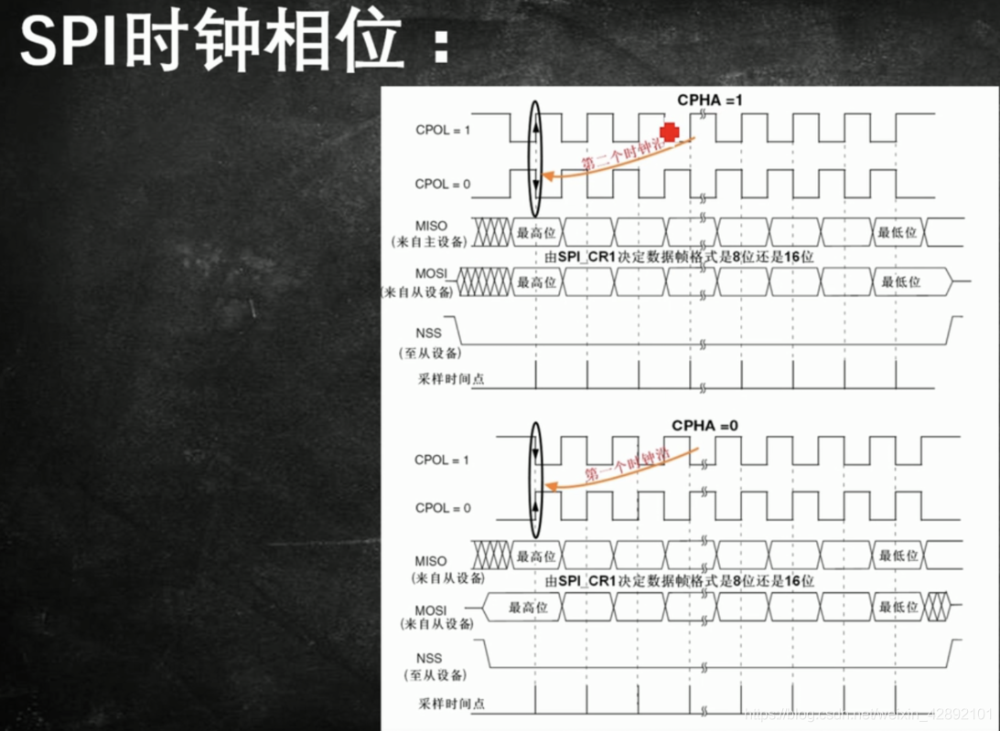

# Audio_SPI_Export_Tool

芯片平台：STM32H743VIT6

操作系统：FreeRTOS V10.3.1

功能作用：虚拟音频输出

通过算法生成正弦音频，输出到SPI1总线，由从机接收，输出到USB Audio Microphone

## 引脚定义

| PIN  | 功能      | 说明 |
| ---- | --------- | ---- |
| PA4  | SPI_CS    |      |
| PA6  | SPI_MISO  |      |
| PA7  | SPI_MOSI  |      |
| PB3  | SPI_CLK   |      |
| PB14 | USART1_TX |      |
| PB15 | USART1_RX |      |

CPOL 时钟极性： 低电平有效

CPHA 时钟相位： 第一个边沿采样数据

[SPI时序参考地址](https://blog.csdn.net/weixin_42892101/article/details/90094710)

## 注意点

不开启MPU、不开器DCache

DMA数据放置0x38000000区域

